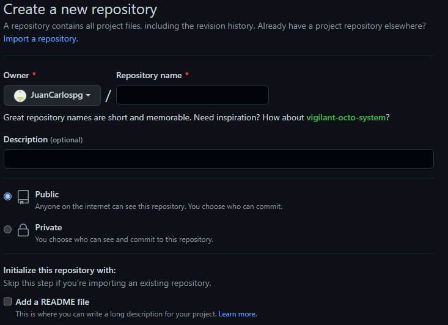

# Documentación MP4UF1 (apuntes)
#### Indice 
- GITHUB
- Markdown
- HTML

1. **GITHUB-GITHUB_PAGES**

   a) Crear cuenta de Github.
   
   Lo primero que hicimos fue crear una cuenta de [GitHub](https://github.com:Portada "Pagina_GitHub"), una vez creada la cuenta de GitHub y verificada, ya podriamos 
   empezar a usar nuestra cuenta.
   
   b) Creacion de repositorios.
   
   Cuando ya estamos dentro del GitHub podemos crear repositorios como se ve en las siguientes imagenes:
   
   
   
   
   En “repository name” ponemos el nombre que queremos que tenga nuestro nuevo repositorio.
   
   Tenemos que elegir si queremos que el repositorio sea público o privado. Si posteriormente queremos activar GitHub pages para poder publicar el repositorio (sólo 
   HTML, CSS básico, no PHP) ha de ser público.
   
   Marcamos la opción de creación del archivo README o no, dependiendo de:
   
   - Si creamos el archivo README, el repositorio se crea e inicializa automáticamente en GitHub.
   
   - En caso de que no se marque el archivo README.md, el repositorio en GitHub se creará vacío y no inicializado.

   -**Clonado y trabajo en local (GIT) de un repositorio de GitHub inicializado (activo).**
  
   Después vamos a la terminal y nos colocamos en la carpeta de nuestro proyecto, ahí escribiremos la siguiente linea:
  
   - git remote add origin [URL de tu repositorio]
   
   Con esto ya tenemos linkeado nuestro repositorio con github o el servicio que estemos usando en el momento. Ahora, si ya tienes archivos para tu primer commit, 
   sigamos los siguientes pasos para subirlo a github, comenzando por agregar los archivos al commit con:
   
   - git add .

   Luego, podemos hacer el commit agregándole un mensaje, recuerda ser clara al escribir este mensaje, pues los otros programadores de tu proyecto lo verán: 
  
   - git commit -m "Un Mensaje"

   Ahora ya estamos listos para hacer push y que los cambios se reflejen en github usando la linea:
  
   - git push -u origin master

   Notar que usamos la opción "-u", esto lo usaremos solo esta vez, y sirve para indicar que estaremos creando esta rama en el repositorio remoto (github en este          caso), si no lo usamos git no sabrá donde subir el commit que recién hiciste, pues master solo existe en tu computadora por el momento.
   
   c) Importar repositorio ya existente en GitHub.
   
   Para poder importar un repositorio tenemos que copiar la URL del repositorio que queramos importar, en la siguientes imagenes se explica como se hace el proceso.
   
   
   
   Cuando ya tenemos la URL copiada tenemos que ir a repositorios y darle a New
   
   
   
   Una vez dentro nos aparece una opcion "import a repository" le damos click
   
   
   
   En “old repository’s clone URL” pegamos la URL del repositorio a importar mientras que en “Repository Name” ponemos el nombre que queremos que tenga nuestro 
   repositorio clonado.
   
   
   
   d) Cómo activar GitHub pages para un repositorio.
   
   Para poder activar el pages de un repositorio tenemos que ir a settings
   
   
   
   Vamos en la opcion de PAGES, el repositorio debe estar en publico para poder activarse. Si el repositorio esta en privado no va dejar
   
   
   
   Escogemos a qué rama asociar “pages” (por defecto “main”) y a qué carpeta (por defecto “root”) y aplicamos configuración con “Save”. Una vez procesado, nos muestra 
   la URL del repositorio.
   
   
